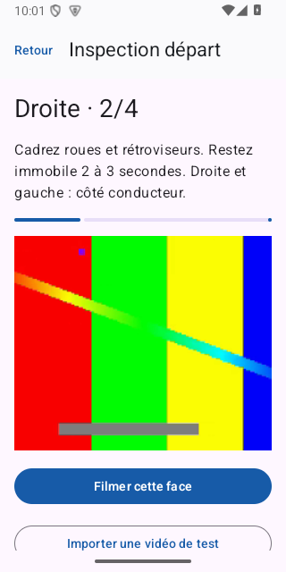
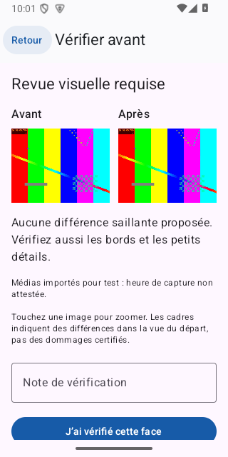
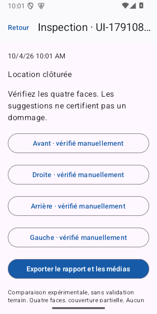

# Vérif Scoot

## En bref

**Ce que c’est :** un prototype Android hors ligne pour documenter une inspection de scooter au départ et au retour.

**À quoi il sert :** capturer les quatre faces, comparer deux états et préparer une revue des changements visuels avant la clôture d’une location.

**Ce qui a été réalisé :** parcours MVP0, caméra, stockage local, comparaison d’images, revue et export. Le parcours a été testé sur émulateur avec des fixtures synthétiques.

**Technologies :** Kotlin, Jetpack Compose, CameraX, SQLite, OpenCV et traitement d’images local.

Il ne certifie pas des dommages et n’a pas encore été évalué sur des scooters réels.

<p>
  
  
  
</p>

Captures réelles du parcours instrumenté sur émulateur Android. Les images colorées sont des fixtures synthétiques, pas des scooters ni des médias clients. Le projet combine Kotlin, Jetpack Compose, CameraX, SQLite, OpenCV et traitement d’images local.

## Installer l’APK

Le script de build produit `artifacts/verif-scoot-debug.apk`. Les sources téléchargées avec **Code → Download ZIP** n’incluent pas ce binaire : construire l’APK avec les instructions ci-dessous. La publication d’une release téléchargeable est en préparation ; aucun lien de release non vérifié n’est annoncé ici.

Une fois l’APK construit, copiez-le sur votre Android (Android 8.1 ou plus récent), ouvrez-le et autorisez l’installation depuis cette source si Android le demande. Ouvrez **Vérif Scoot**, puis autorisez la caméra au moment de filmer. Aucun compte, microphone, GPS ou accès Internet nécessaire.

L’APK debug est signé pour les essais. Conservez vos exports : désinstaller l’application efface ses données privées. Une mise à jour avec la même clé via `adb install -r` conserve normalement les inspections.

## Premier essai

1. Ajouter le scooter avec son numéro interne.
2. Nouvelle location → Inspection départ.
3. Filmer l’avant 2–3 secondes, arrêter, vérifier l’image retenue et la conserver. Continuer droite, arrière, gauche (côtés du conducteur).
4. Au retour : sélectionner le même scooter → Reprendre la location → Inspection retour, avec le même protocole.
5. Ouvrir chaque face, regarder Avant et Après, toucher une image pour zoomer, confirmer/ignorer la suggestion ou valider votre revue manuelle.
6. Clôturer et exporter le rapport avec les médias. L’archive ZIP contient les originaux, les images extraites, un rapport texte et un manifeste JSON avec SHA-256 et historique des revues.

Une face peut être refilmée **avant de la conserver**. Après conservation elle est immuable dans ce prototype. L’application reprend la première face manquante après une interruption. Un clip non confirmé au moment d’une fermeture doit être repris.

Pour tester avec un fichier : **Importer une vidéo de test**, puis choisir un clip de cette face (0,5 à 120 s, maximum 200 Mo). Le fichier est copié ; l’original choisi n’est pas modifié. Les médias importés sont identifiés comme tests. Import présent seulement dans le build debug.

## Limites à comprendre

- Quatre faces, pas une inspection exhaustive des diagonales ou du dessous.
- Images nettes, cadrage proche et lumière comparable indispensables. Aucune mesure de taille/profondeur de rayure.
- ORB + homographie + différence photométrique, sans modèle entraîné de dommages ni segmentation sémantique. Le masque central peut inclure du décor ; les bords sont peu couverts.
- « Non comparable » signifie revue manuelle nécessaire. Aucune alerte ne garantit jamais l’absence de dommage.
- Capture par clips, pas tour continu automatiquement reconnu. Pas de conseils temps réel fondés sur la géométrie.
- Pas de synchronisation, compte opérateur authentifié, photo de détail, prix, PDF ou stockage cloud. Export ZIP manuel ; aucun effacement automatique.
- Heure du téléphone et hashes : contrôle de cohérence, pas horodatage certifié ni décision de responsabilité.
- Le téléphone physique, la thermique, les petits dommages et l’utilité commerciale restent à tester.

## Construire

Prérequis : JDK 17+ (JDK 21 utilisé ici), SDK Android plateforme 35/build-tools 35.0.0, réseau au premier build. `local.properties` doit contenir `sdk.dir=/chemin/du/sdk` et reste hors Git.

```sh
./scripts/build.sh
```

Le script utilise Gradle Wrapper 8.13, compile, lance tests JVM/lint, construit les tests Android et copie l’APK. Sur une autre machine, définir `JAVA_HOME`. Sources APK standard : `app/build/outputs/apk/debug/app-debug.apk`.

Versions : AGP 8.13.2, Kotlin 2.2.21, Compose BOM 2025.04.01, CameraX 1.4.2 et OpenCV 4.13.0. Versions stables épinglées pour cette preuve sur SDK installé ; des versions plus récentes existent. Release/Play n’est pas configuré : conserver une vraie clé de signature hors Git avant distribution commerciale.

## Tests sur émulateur

Un SDK et un AVD dédiés sont dans `.tools/`, exclus de Git. Pour les recréer sur Apple Silicon : installer `emulator`, `platform-tools`, `system-images;android-35;google_apis;arm64-v8a`, puis créer l’AVD `scoot_api35`. Les licences officielles Android doivent être acceptées sur la machine de build. Utiliser une image x86_64 sur hôte Intel compatible.

```sh
./scripts/test-emulator.sh
```

Le script ne cible que `emulator-5554`. Les fixtures de `app/src/androidTest/assets` sont synthétiques et ne sont pas embarquées dans l’APK utilisateur. Les tests UI, les tests pipeline et le capteur émulé valident des dimensions distinctes. Voir `docs/VALIDATION.md` pour les résultats effectifs, les erreurs corrigées et les limites.

## Installer et diagnostiquer par USB

Activer Options développeur → Débogage USB, brancher le téléphone et accepter l’empreinte du Mac sur le téléphone.

```sh
adb devices
adb -s SERIAL install -r artifacts/verif-scoot-debug.apk
adb -s SERIAL shell am start -n com.scootcheck.app/.MainActivity
adb -s SERIAL logcat -d -b crash > crash.txt
```

Remplacer `SERIAL` par celui affiché par `adb devices`. Pour un bug, joindre modèle, version Android, action précise et log crash vérifié. Ne pas partager des médias clients sans autorisation.

## Documents

- `docs/BLUEPRINT.md` : étude de marché sourcée, décisions et protocole de validation.
- `docs/superpowers/plans/2026-09-13-scooter-mvp.md` : plan initial et critères.
- `docs/VALIDATION.md` : statut réel du livrable.
- `docs/PORTFOLIO-VERIFICATION.md` : reconstruction, tests et captures réalisés pour la préparation du portfolio.
- `docs/THIRD_PARTY.md` : dépendances et provenance des fixtures.

## Dépôt et téléchargement

[Voir le dépôt](https://github.com/cpointis96-hue/verif-scoot) · [Télécharger les sources ZIP](https://github.com/cpointis96-hue/verif-scoot/archive/HEAD.zip). Le ZIP contient les sources ; il faut construire l’APK selon les instructions ci-dessus.
