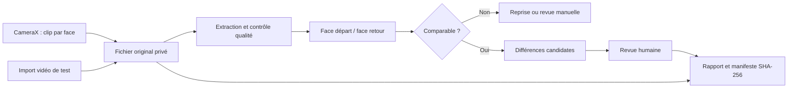

# SCOOTER INSPECTION — MVP TECHNICAL & PRODUCT BLUEPRINT

Version de décision du 13 septembre 2026. Recherche documentaire réalisée avant l’implémentation. Les objectifs chiffrés ci-dessous sont des hypothèses de validation, pas des performances mesurées. Les déclarations commerciales sont attribuées aux fournisseurs ; aucune application concurrente n’a été testée avec un scooter réel pendant cette étude.

## 1. Executive summary

Construire un outil Android qui organise le départ et le retour, retrouve les vues correspondantes et aide un employé à vérifier les changements visibles. Ne pas présenter une différence de pixels comme une rayure certaine, une absence d’alerte comme une absence de dommage, ni une capture comme un contrôle de sécurité mécanique.

**Options étudiées :** A. vidéo libre et reconstruction 3D ; B. tour guidé avec pauses par face et comparaison 2D ; C. formulaires et photos manuelles.

**Décision : B.** Premier incrément : quatre clips courts, un par face, dont on extrait automatiquement une image nette. L’utilisateur suit le tour avant → droite → arrière → gauche (droite/gauche du conducteur). Le retour reprend ces mêmes faces. La sélection d’une location ouverte évite un rapprochement ambigu. Comparaison locale expérimentale avec abstention et revue humaine. Aucun backend nécessaire à la preuve technique.

**Pourquoi :** réduire la variabilité d’acquisition avant d’augmenter la complexité du modèle. Un comparateur qui montre rapidement les bonnes images peut déjà battre une galerie désorganisée.

**Pourquoi pas A :** carénages brillants, faible texture, surfaces cachées, changements de lumière et coût d’optimisation rendent une 3D complète disproportionnée. Une belle synthèse de vue ne constitue pas une observation physique.

**Pourquoi pas C :** bon témoin expérimental, mais sélection et classement de nombreuses photos pénalisent l’usage répété.

L’investissement suivant dépend de deux preuves distinctes : gain de temps du parcours sur le terrain et précision utile des suggestions. La première peut réussir alors que la seconde échoue.

## 2. Problème

Le problème n’est pas seulement de détecter des dommages : il faut retrouver le bon véhicule, la bonne location, le bon départ, la bonne face et une preuve lisible. Les coûts cachés sont le tri, le re-visionnage et le désaccord au comptoir. Une fine rayure invisible dans la capture est irrécupérable par le logiciel.

Un scooter a de petites surfaces courbes, des miroirs, des pièces mobiles, des autocollants et des éléments ajourés. Les modèles automobiles ne se transfèrent pas automatiquement. Les dommages mécaniques internes, freins, pression des pneus et état du moteur sortent du périmètre visuel.

## 3. Proposition de valeur

« Au retour, retrouvez immédiatement les vues du départ et vérifiez les changements visibles. » La valeur automatique promise au pilote reste « zones à examiner », sans classification ni facturation automatique. Conserver les dommages déjà présents et la couverture manquante évite de confondre nouveauté et découverte tardive.

Le client doit pouvoir voir les deux originaux. Un avantage commercial fondé sur davantage de dommages facturés risque de détériorer la confiance ; préférer moins de temps perdu et des décisions explicables.

## 4. Concurrents existants

Les limites et jugements UX de ce tableau sont des analyses de leurs parcours publics, pas des résultats de tests. « Non publié » signifie non trouvé dans les pages consultées, pas inexistence d’un tarif.

| Solution et source | Marché, parcours et technologie déclarée | UX et prix constatables | Limite / adéquation scooter / différenciation possible |
|---|---|---|---|
| [Tractable](https://tractable.ai/) et [AI Inspection](https://tractable.ai/ja/new-ai-solution-accurately-assesses-vehicle-condition-in-minutes/) | Assurances, flottes ; capture smartphone guidée et analyse de dommages ; deep learning déclaré | Tour du véhicule, intégrations API ; tarif non publié | Offre automobile mature ; précision scooter et accès petite agence non prouvés. Différenciation : simplicité offline et acquisition scooter |
| [Ravin](https://www.ravin.ai/) | Assurances/flottes ; capture mobile guidée, revue 360°, suivi d’état et CCTV selon produit | Capture web sans installation annoncée ; démo commerciale, prix non publié | Très proche fonctionnellement ; disponibilité d’un modèle scooter à demander. Ne pas inventer son architecture interne |
| [WeProov](https://www.weproov.com/) | Loueurs, convoyeurs et assureurs ; application, plateforme, rapports, devis ; contrôle flou/luminosité/présence annoncé | Capture structurée, services de chiffrage ; prix non vérifié | Référence directe pour la documentation, support français ; workflow scooter et tarifs locaux à tester |
| [Record360](https://record360.com/lp/truck-rental/) | Location véhicules/équipements ; photos, vidéos, comparaison côte à côte et synchronisation offline annoncées | Offre camion annoncée dès 295 USD/mois/site, pas un tarif garanti pour scooters | Le problème de preuve organisée est déjà couvert ; petit loueur potentiellement sensible au prix. Ne pas confondre contrôle flou et détection de dommage |
| [UVeye](https://www.uveye.com/hertz-partnership/) | Portiques caméra et ML, carrosserie/pneus/soubassement, déploiement automobile chez Hertz annoncé | Passage rapide mais infrastructure physique ; prix non publié | Inadapté au MVP sans matériel spécialisé ; apporte une référence de capture contrôlée |
| [Focalx](https://focalx.ai/vehicle-inspection/solutions/) | Inspection automobile, analyse IA et parcours personnalisable | Offre B2B ; prix et expérience scooter non vérifiés | À inclure dans un achat-versus-construction ; performance locale non prouvée |
| [Monk SDK](https://monkvision.github.io/monkjs/docs/introduction/) | SDK React/React Native + API ; acquisition et rapport modifiable | Intégration documentée ; conditions commerciales à obtenir | Réduit le développement si SDK adapté aux scooters ; crée dépendance cloud et fournisseur |
| [ScanMyRental](https://scanmyrental.com/) | Voyageurs/loueurs ; scooters explicitement cités, angles guidés, revue IA, avant/après et PDF annoncés | Six angles scooter affichés ; [page prix](https://scanmyrental.com/pricing) indisponible lors de consultation | Concurrent conceptuel très direct. Maturité, offline, exactitude et usage employés non validés ; ne pas conclure que la niche est libre |
| [RentalTide](https://rentaltide.com/ai/damage-inspection/) | Gestion locative avec comparaison IA et estimation annoncées | Moins de 30 s annoncé ; pas un benchmark indépendant | Offre à tester, spécialement faux positifs et couverture scooters ; ne pas reprendre ses chiffres comme preuve |
| [KeysBlu](https://www.keysblu.com/features/rental-damage-inspection-app) | Photos départ/retour liées à location et véhicule | Workflow métier intégré ; prix non examiné | Concurrence sur organisation et simplicité, même sans IA |
| [PhotoFlow Inspect Android](https://play.google.com/store/apps/details?hl=en_US&id=com.silentbytelabs.photoflowinspector.car) | Capture guidée, notes et export PDF/ZIP annoncés | Application Android avec achats intégrés | Alternative documentaire mobile ; précision et comparaison scooter non établies |

Ni les sites vendeurs ni une recherche web ne démontrent le product-market fit. Faire tester au moins une alternative documentaire et une offre IA sur le même protocole avant d’engager un entraînement propriétaire. Aucun contact commercial ni envoi de médias n’a été effectué.

## 5. Enseignements de recherche

Le marché couvre déjà trois niveaux : documentation, inspection IA smartphone et capture matérielle contrôlée. La différenciation défendable est un corpus longitudinal scooter autorisé, un protocole rapide et une intégration au travail réel. « IA + photos » ne suffit pas.

Achat-versus-construction : demander ultérieurement aux fournisseurs un essai aveugle avec 50 paires, export des données, tarif minimum, offline, rétention, région d’hébergement et droit d’utiliser les annotations. Acheter si le coût total et la qualité mesurée battent le prototype. Les interfaces privées des concurrents restent à essayer.

## 6. Persona principal

Employé d’une agence de 30 scooters, téléphone Android partagé, interruptions fréquentes, mains parfois humides, lumière extérieure, connexion inconstante. La langue initiale du prototype est le français pour son propriétaire ; avant pilote, confirmer la langue des employés et les contrats et pratiques de l’agence par entretien. Ce profil de travail reste une hypothèse à tester.

Décideur économique : responsable d’agence. Utilisateur secondaire : client qui vérifie le constat. Hypothèses non encore observées : 30 à 90 secondes acceptables par capture et intérêt pour un rapport exportable.

## 7. Parcours utilisateur complet

Créer le scooter avec un seul identifiant interne unique ; pas de VIN ou formulaire client imposé. QR ultérieur encode un identifiant interne, jamais une identité client. OCR de plaque proposé seulement avec confirmation ; couleur/modèle ne constituent pas une identité fiable.

Départ : choisir le scooter → débuter → capturer quatre faces → terminer. Une location ouverte contient un départ immuable. Retour : même scooter → reprendre sa location ouverte → quatre faces → revoir les suggestions → clôturer. Si plusieurs locations sont ouvertes, corriger le modèle métier plutôt que choisir silencieusement la plus récente.

Interruption : sauver chaque face séparément ; reprendre la face manquante. Un départ complet ne doit jamais être écrasé par un retour. Clôturer la location seulement après revue, même si l’analyse ne trouve rien. Nouveau départ crée un nouvel identifiant.

Options de capture : A. vidéo continue libre, 30–60 s ; B. quatre clips de 2–5 s en avançant autour ; C. 8–12 photos guidées. Décision B pour le prototype ; comparer B contre C au pilote. Une seule vidéo à pauses devient MVP2 si elle réduit réellement le nombre de gestes sans dégrader la couverture.

## 8. UX écran par écran

1. **Scooters** : liste recherchable et « Ajouter un scooter ». Nom unique suffisant. État vide explicite. Pas de dashboard statistique.
2. **Location du scooter** : action principale contextuelle « Inspection départ » ou « Inspection retour ». Historique secondaire. Empêcher un deuxième départ tant que la location est ouverte.
3. **Capture** : face attendue en grand, aperçu, une consigne courte et bouton enregistrer/arrêter. Avancement quatre faces, possibilité de reprendre. Import de vidéo explicitement marqué test. Pas de badge « couvert » fondé uniquement sur le temps écoulé.
4. **Comparaison** : liste par face, état « À vérifier », « Non comparable » ou « Aucune différence saillante proposée ». Avant et après, zoom et confirmation/ignorance. Pas de pourcentage de confiance non calibré.
5. **Rapport** : faces, originaux, statut de revue et notes ; exporter, puis clôturer. Pas de montant suggéré par IA. Ajouter un prix manuel est secondaire et doit préciser devise et auteur avant disponibilité terrain.

Le slider ne remplace pas deux images non alignées : commencer côte à côte / bascule avant-après, puis superposition uniquement lorsque la registration passe ses contrôles. Orange = suggestion ; rouge réservé au constat humain confirmé, accompagné de texte. Cibles tactiles ≥48 dp, texte qui accepte agrandissement, contraste, écran défilable, boutons accessibles avec TalkBack. Les erreurs restent visibles avec une action de reprise.

Direction : outil terrain Android natif, fond clair, texte sombre, un accent bleu, photos dominantes ; pas d’illustration marketing. Material 3, états standards, mouvement limité à la progression. ENERGY 1 / RHYTHM 1 / MOTION 1. La simplicité opérationnelle du brief guide ce choix.

## 9. Architecture technique

MVP0 : un module Android, un stockage privé et un moteur CV local. Les sources caméra et fichier convergent vers la même extraction et la même comparaison. Pas de serveur, de compte cloud ou de service payant.



Une séparation capture / médias / comparaison / données suffit. Pas de framework DI, réseau ou abstraction multi-backend avant nécessité. Le pilote mono-téléphone doit être explicite : le retour sur un autre téléphone nécessite une synchronisation, donc MVP1 réseau.

## 10. Choix de stack justifié

| Critère | Kotlin + Compose | Flutter | React Native / Expo | Web/PWA / Java Views |
|---|---|---|---|---|
| Caméra/vidéo | CameraX direct, cycle de vie Android | [camera_android_camerax](https://pub.dev/packages/camera_android_camerax), pont natif pour besoins fins | [Expo Camera](https://docs.expo.dev/versions/latest/sdk/camera/) capture standard ; modules natifs pour analyse avancée | PWA moins de contrôle ; Java direct mais UI plus verbeuse |
| CV et buffers | OpenCV Java/JNI, pas de pont JS/Dart | FFI ou plugin, copies à mesurer | Modules natifs, éviter transit frames par JS | PWA contraintes mémoire/codec ; Java très adapté CV |
| ML local | LiteRT/ONNX via API Android | Plugins ou FFI | Modules natifs ; Expo Go ne suffit pas à toute extension native | Variable navigateur ; Java mêmes runtimes Android |
| GPU | Accélération selon runtime, opérateurs et appareil | Même dépendance matérielle plus pont | Idem | Aucun GPU universel garanti |
| APK/tests | Gradle, Compose tests, UIAutomator | build apk, tests Flutter, tests intégration | build natif/development build, tests JS + natifs | PWA n’est pas l’APK natif demandé |
| Maintenance | Une seule plateforme, documentation Google directe | Utile si iOS devient prioritaire | Utile avec équipe React existante | Java Views viable mais pas d’avantage ici |

**Décision : Kotlin + Jetpack Compose + CameraX.** Android seul et pipeline caméra prioritaire. Flutter et RN ne sont pas incapables : leurs bénéfices multiplateformes ne compensent pas ici l’intégration native supplémentaire. Java Views reste une solution minimale possible, pas retenue pour la maintenance UI.

[CameraX](https://developer.android.com/media/camera/camerax/video-capture) fournit Recorder, VideoCapture et sélecteur de qualité. [LiteRT](https://developers.google.com/edge/litert/android/gpu) et [ONNX Runtime Mobile](https://onnxruntime.ai/docs/tutorials/mobile/) sont des options après choix du modèle, pas des dépendances à accumuler. MediaPipe sert à construire des pipelines de tâches ; il ne fournit pas à lui seul un détecteur de dommages scooter. OpenCV est suffisant pour le premier baseline, CPU d’abord.

Épingler les versions réellement compilées. AGP 8.13.2 avec Gradle 8.13 est une base compatible documentée ; SDK 35 présent sur ce Mac. Ne pas confondre build sideload et conformité de publication Play. [Compatibilité officielle](https://developer.android.com/build/releases/agp-8-13-0-release-notes).

## 11. Pipeline caméra

Protocole initial à mesurer : scooter arrêté, moteur coupé, stable sur sa béquille habituelle, guidon dans une position reproductible. Départ face avant, progression par côté droit puis arrière et gauche. Garder le scooter entièrement dans le cadre, roues et rétroviseurs compris. Téléphone à environ 0,9–1,2 m, distance initiale 1,5–2 m à ajuster au champ de vision, objectif principal 1×. Ne pas prétendre mesurer une distance métrique sans calibration.

Avancer lentement, s’arrêter 2–3 s à chaque face. Le clip accepte un léger changement d’angle permettant de choisir une image nette. Capturer roues/parties basses avec un complément bas à 0,4–0,6 m si nécessaire ; pas d’inspection complète du dessous, et ne pas se glisser sous le véhicule. Quatre faces ne couvrent pas tous les trois-quarts : l’état de couverture doit le dire. Le pilote décidera s’il faut ajouter quatre diagonales.

1080p visé, fallback matériel explicite ; sans audio. Inspection courte, fichier privé, finalisation vidéo attendue avant extraction. Préserver rotation et ratio. Décoder progressivement, jamais toutes les frames simultanément. Échantillonner quelques instants par clip et classer par netteté/exposition ; sauvegarder le timestamp demandé et la méthode, puisque [MediaMetadataRetriever](https://developer.android.com/reference/android/media/MediaMetadataRetriever) peut retourner une frame proche, pas exactement celle demandée.

Contrôle qualité : moyenne de luminance, proportion de pixels écrêtés, énergie de gradient/flou, variation entre frames. Seuils liés à résolution et caméra à calibrer. [ImageAnalysis](https://developer.android.com/media/camera/camerax/analyze) nécessite fermeture de chaque ImageProxy et stratégie de backpressure ; éviter d’empiler des frames. La disponibilité simultanée de Preview, VideoCapture et Analysis varie : tester, sinon contrôler le clip après capture.

Mauvaise lumière : se déplacer vers une zone éclairée ; soleil/reflets : ombre ouverte et angle proche du départ ; nuit : demander une nouvelle capture éclairée, ne pas améliorer artificiellement la preuve ; pluie/scooter mouillé : signaler non comparable et sécher si possible ; mur : déplacer le scooter ou marquer face inaccessible ; personnes : patienter/recapturer ; plusieurs scooters : cadre serré et identifiant confirmé. L’application ne doit pas inventer une couverture à partir du gyroscope.

## 12. Pipeline Computer Vision : options et décision

Estimations qualitatives, aucune précision scooter mesurée. Les coûts/latences dépendront des tailles, modèles et appareils.

| Approche | Faisabilité / robustesse | Données / vitesse / complexité | Licence et décision |
|---|---|---|---|
| A. Vues normalisées + différence | Facile ; sensible lumière, cadrage, décor | Aucun entraînement, CPU, faible complexité | Baseline local ; jamais classifieur de dommage |
| B. Masque + keypoints + homographie locale | Bonne sur un panneau peu courbe ; échec sur surfaces brillantes ou parallax | Peu de données pour géométrie, masque éventuellement appris, CPU | OpenCV ; retenue comme évolution de A. Une homographie globale ne modélise pas un scooter 3D |
| C. Embeddings par zone (DINOv2) | Retrouve une vue malgré variations ; petits défauts peuvent disparaître dans représentation | Préentraîné, coût CPU/GPU et mémoire supérieurs | [DINOv2](https://github.com/facebookresearch/dinov2) standard Apache 2.0 ; modèles médicaux ajoutés au dépôt ont d’autres licences. Challenger pour matching, pas preuve sémantique |
| D. LightGlue + DISK/ALIKED | Rapprochement plus robuste à tester ; ne détecte pas les dommages | Préentraîné, CPU possible, GPU utile | [LightGlue](https://github.com/cvg/LightGlue) Apache 2.0 ; SuperPoint a une licence restrictive distincte. Préférer DISK/ALIKED après vérification des checkpoints |
| E. VLM multimodal | Peut décrire une différence ; hallucinations et localisation imparfaite | Zero-shot, cloud ou gros modèle local, latence/coût variables | Licence/API dépend du modèle ; pas de décision facturable. Évaluation aveugle avant ajout |
| F. Photogrammétrie / NeRF / splatting | Reconstruction possible dans conditions favorables ; texture spéculaire et occultations problématiques | Plusieurs vues, pose estimation, optimisation ; coût et complexité élevés | [COLMAP BSD](https://colmap.github.io/license.html) ; [implémentation INRIA](https://github.com/graphdeco-inria/gaussian-splatting) licence spécifique ; [gsplat Apache](https://arxiv.org/abs/2409.06765) autre option. Hors MVP |
| G. Hybride qualité + registration + différences + humain | Permet l’abstention, conserve utilité documentaire | Aucun entraînement initial, complexité maîtrisée | Décision MVP ; ajouter un modèle seulement s’il bat le baseline sur données gelées |

[OpenCV](https://docs.opencv.org/4.x/d1/de0/tutorial_py_feature_homography.html) documente le matching et RANSAC ; le nombre d’inliers n’est pas une probabilité de dommage. Prévoir des refus : trop peu de points, support géométrique trop concentré, déformation extrême, recouvrement faible ou changement global. Une registration estimée sur le décor peut être mathématiquement bonne et physiquement fausse : limiter à une région de véhicule et, tant que sa segmentation manque, afficher la limite.

Segmentation SAM2 : [code et poids Apache 2.0](https://github.com/facebookresearch/sam2), utile pour annoter et suivre un objet désigné ; n’identifie pas à lui seul un scooter ni ses pièces. Depth estimation monoculaire : utile pour occultation/cohérence grossière, insuffisante pour mesurer une bosse fine sans vérité métrique. Object detection : présence rétroviseur/optique avec dataset scooter ; une absence de détection n’est pas une pièce manquante.

## 13. Stratégie avant/après

Appairer par locationId et face, puis sélectionner des candidats de pose proche dans les clips. Les premières images doivent préserver la même orientation. Registration robuste, masque de recouvrement, normalisation photométrique modérée uniquement sur dérivés. Calculer différence locale et regroupement spatial, masquer bords de warp, rejeter changement global.

Le baseline peut signaler une tache, un sticker ou une ombre : libellé « Changement visuel possible ». Revue humaine obligatoire avec originaux indépendants de la transformation. Si une zone est masquée au départ, elle n’est pas nouvellement endommagée mais inconnue. Pour ignorer, conserver un motif (reflet, saleté, ancien, mauvais alignement, autre) plutôt que convertir automatiquement en exemple négatif.

Une absence de suggestion doit être formulée avec sa limite ; une face non comparable ne devient jamais verte. Pas d’estimation de prix, de responsabilité ou de profondeur de rayure. Une vue avant/après alignée aide l’utilisateur mais n’ajoute pas d’information absente des originaux.

## 14. Stockage et intégrité

Modèle cible : Scooter(id, label), Rental(id, scooterId, state), Inspection(id, rentalId, kind, operatorId, deviceTime, source), Media(id, inspectionId, face, file, sha256, requestedFrameTime), Finding(id, pair, bounds, algorithmVersion, status), Review(eventId, findingId, actor, decision, note, time).

Pour prototype mono-appareil, SQLite Android avec transactions suffit ; Room est préférable lorsque migrations/requêtes se multiplient. Médias dans filesDir, jamais BLOB vidéo en base. Les commits de base ne référencent que des fichiers finalisés ; fichiers temporaires éliminables après interruption. Départ/retour séparés, UUID stables, décisions revues auditables. Rapport portable : JSON et médias avec SHA-256, présentation lisible en complément. Ne pas altérer les originaux avec compression ou annotation.

Budget local à surveiller : 1 000 inspections × 40 Mo = 40 Go. Ne pas supprimer automatiquement la seule preuve. Prévenir stockage insuffisant, permettre export et définir une politique de rétention avant pilote. Un prototype sans sauvegarde n’est pas une archive durable.

## 15. Backend

**Options :** FastAPI/Python ; Node/TypeScript ; Supabase/Postgres ; Firebase ; Cloudflare Workers + R2 ; Neon + stockage objet.

**Décision MVP0 : aucun.** Évite upload, comptes et perte d’utilité réseau. **MVP1 multi-appareils : FastAPI monolithique + Postgres + stockage objet privé**, un worker seulement si la durée du traitement l’impose. Python partage naturellement les expérimentations CV. Node serait aussi bon pour orchestration mais pas un avantage pour ce pipeline. Supabase accélère auth/Postgres/stockage mais ne résout pas la CV ; Firebase facilite synchronisation mais modèle documentaire et couplage à peser ; Workers/R2 bons pour API légère/stockage, pas un substitut général à un runtime GPU ; Neon est une DB, pas un moteur ML.

API proposée : création d’inspection idempotente par UUID, URL upload signée à expiration courte, finalisation avec hashes, job d’analyse, lecture du résultat versionné. Isolation agence, contrôle d’appartenance de chaque objet. Aucun bucket public. Upload original différé sur Wi-Fi ; images de comparaison prioritaires. Un résultat d’un ancien job ne remplace pas une décision humaine plus récente.

## 16. Sécurité et preuve

Prototype : stockage privé Android, pas de secret embarqué, pas d’Internet requis, pas d’audio ni GPS, backup automatique désactivé pour éviter une copie cloud implicite. L’identité « opérateur local » n’est pas une authentification d’employé ; pilote devra enregistrer un identifiant d’opérateur et gérer téléphone partagé/verrouillage.

Un SHA-256 prouve qu’un fichier correspond à une empreinte donnée ; il ne prouve ni la date réelle, ni l’identité du scooter, ni l’absence de manipulation avant hachage. Heure du téléphone modifiable. MVP1 : heure de réception serveur, manifeste signé et événements append-only ; horodatage externe seulement si besoin démontré. Images importées sont marquées test/import, jamais attestées comme captures live.

Avant déploiement commercial : rétention, droits des clients, accès des employés, procédure de contestation et règles de transfert selon pays avec validation juridique locale. Ce document ne conclut pas à une recevabilité en justice. Minimiser visages/plaques de tiers ; flouter les dérivés de partage si nécessaire, conserver original avec accès restreint. Ne pas collecter GPS ou données clients simplement parce que c’est possible.

## 17. Fonctionnement offline

Départ, retour, comparaison et rapport local sans réseau. Si retour réalisé ailleurs, absence du départ doit être affichée, pas remplacée par une ancienne inspection. MVP1 : outbox persistante, WorkManager avec contraintes réseau, backoff borné, IDs idempotents, reprise upload et checksum serveur. Afficher « sauvegardé sur téléphone » indépendamment de « synchronisé ».

Capture et synchronisation ne bloquent pas l’employé ensemble. Le serveur est autorité sur location multi-appareils : conflits explicitement résolus, pas last-write-wins sur les preuves. Précharger les départs des retours attendus et tester mode avion.

## 18. Stratégie de tests

Trois validations indépendantes : logique de location, robustesse média/CV, utilité terrain. Tests unitaires sur transitions illégales, identité face, intégrité et décisions ; tests instrumentés sur SQLite et pipeline vidéo ; tests UI sur parcours complet et reprise.

Fixtures synthétiques autorisées : identique, translation, changement local, éclairage global, flou, image uniforme, format corrompu, vidéo portrait, rotation, absence de texture. Elles prouvent le comportement du code, pas la précision scooter. Dataset réel gelé séparé par véhicule/agence, jamais frames voisines réparties train/test.

Critères de sortie build : compilation et lint sans erreur, tests unitaires et instrumentés, captures d’écran des états principaux, installation APK. Critères terrain distincts : deux téléphones dont un entrée de gamme, soleil/ombre/nuit, chaleur, interruption et stockage faible. Les scénarios non exécutés seront listés explicitement.

## 19. Android emulator

Android Studio n’est pas obligatoire : SDK command-line tools, platform-tools/adb, emulator et AVD suffisent. Sur Apple Silicon, image arm64-v8a. AVD dédié au projet pour éviter de modifier un appareil utilisateur. API 35 en premier, puis minSdk 27 et version Android récente en matrice.

La [documentation CLI](https://developer.android.com/studio/run/emulator-commandline) prévoit camera-back emulated/webcam/imagefile/videofile. Vérifier la version installée et un essai effectif ; ne pas généraliser cette disponibilité à tous les anciens émulateurs. Virtualisation et accès caméra macOS peuvent imposer une permission système.

## 20. Automatisation des tests par agent

**Options :** Compose/Espresso pour app ; UIAutomator pour système ; Maestro pour scénarios YAML ; Appium pour infrastructure WebDriver ; Computer Use pour revue visuelle exploratoire ; Playwright pour backend web futur seulement.

**Décision : Gradle + tests Compose + UIAutomator + adb.** Pas besoin de serveur Appium ni dépendance supplémentaire Maestro au premier incrément. [UIAutomator](https://developer.android.com/training/testing/other-components/ui-automator) accède aux fenêtres et screenshots ; [Maestro](https://docs.maestro.dev/getting-started/build-and-install-your-app/android) reste une bonne option pour des agents écrivant des parcours ; [Appium](https://github.com/appium/appium-uiautomator2-driver) utile si une ferme mobile l’exige.

Boucle : build → démarrer AVD → attendre sys.boot_completed → installer APK et tests → démarrer activité → exécuter scénario → screenshots + arbre UI + logcat → corriger un échec reproduit → rebuild/réinstaller → même test. Timeout explicite à chaque attente. Ne pas effacer les données d’un vrai téléphone pour rendre un test vert.

```sh
./gradlew testDebugUnitTest lintDebug assembleDebug assembleDebugAndroidTest
adb -s emulator-5554 install -r app/build/outputs/apk/debug/app-debug.apk
adb -s emulator-5554 shell am start -n com.scootcheck.app/.MainActivity
./gradlew connectedDebugAndroidTest
adb -s emulator-5554 exec-out screencap -p > artifacts/screen.png
adb -s emulator-5554 shell uiautomator dump /sdcard/window.xml
adb -s emulator-5554 pull /sdcard/window.xml artifacts/window.xml
adb -s emulator-5554 logcat -d -b crash > artifacts/crash.log
```

Ces commandes sont le protocole cible ; le rapport de validation distingue leur exécution effective. Choisir explicitement le serial lorsqu’un téléphone réel est aussi connecté.

## 21. Stratégie tests caméra

Le mode import vidéo est une bonne décision : il traverse le même stockage, décodage, sélection de frame et comparaison que le live. Son origine est visible et exportée. Un fichier choisi via Storage Access Framework est copié dans le stockage privé, donc un droit URI temporaire perdu ne casse pas l’inspection.

Pour CI, fixtures vidéo intégrées au seul APK de test, injectées par instrumentation ; pas de bouton caché livrant un faux résultat pré-calculé. Mock CameraX uniquement pour erreur/permission, pas pour prétendre tester capteur et autofocus. Caméra virtuelle = validation de plomberie ; vidéo réelle rejouée = validation du traitement ; vrai téléphone = validation de netteté, mouvement, exposition et thermique. Les trois se complètent.

## 22. Génération APK et test personnel

`./gradlew assembleDebug` produit `app/build/outputs/apk/debug/app-debug.apk`. Debug signé automatiquement par clé de développement, debuggable ; utilisable en sideload. Release destiné distribution nécessite une clé privée durable protégée hors dépôt et une configuration de signature ; changer de clé interdit normalement la mise à jour en place. Ne pas distribuer la clé debug comme clé de production.

Copier l’APK sur Android, ouvrir le fichier, autoriser l’installation depuis cette source lorsque le système le demande, installer, autoriser caméra au premier usage. Pas de permission microphone nécessaire. Pour import vidéo utiliser le sélecteur système, pas un accès global à toute la galerie.

USB : activer options développeur et débogage USB, brancher, accepter l’empreinte RSA sur téléphone ; `adb devices`, puis `adb -s SERIAL install -r app/build/outputs/apk/debug/app-debug.apk`. Mise à jour conserve normalement les données ; désinstallation les supprime. En cas de crash, `adb -s SERIAL logcat -d -b crash` et noter action, modèle, version Android. Ne pas partager un log complet contenant des données personnelles sans le vérifier.

## 23. Coûts et business model

Hypothèses calculables : une inspection = un état départ OU retour. 2 000 inspections/mois = 1 000 locations, soit dix locations par scooter pour 100 scooters. 20 s total de vidéo à 8 Mbit/s = 20 Mo ; scénario prudent 40 Mo avec images/dérivés. Upload 40 Mo à 2 Mbit/s prend 160 s hors overhead ; 4 Mo d’images prennent 16 s. Donc upload vidéo ne doit pas bloquer le comptoir.

[R2 Standard](https://developers.cloudflare.com/r2/pricing/) affiche 0,015 USD/Go-mois, opérations A 4,50 USD/million, B 0,36 USD/million, sortie Internet sans frais R2. Arrondis et gratuités affectent la facture réelle. Calculs ci-dessous bruts hors crédits, taxes, stockage local, sauvegarde et frais tiers.

| Volume mensuel | Ingestion à 40 Mo | Stock stationnaire 90 jours | Stock brut/mois | Budget fixe hypothétique 25 USD réparti |
|---|---:|---:|---:|---:|
| 500 inspections | 20 Go | 60 Go | 0,90 USD | 0,050 USD/inspection |
| 2 000 | 80 Go | 240 Go | 3,60 USD | 0,0125 USD/inspection |
| 10 000 | 400 Go | 1 200 Go | 18 USD | 0,0025 USD/inspection |

À 12 mois de rétention : 960 Go et 14,40 USD/mois pour 2 000 inspections mensuelles. Une hypothèse de dix écritures par inspection donne 20 000 opérations A : 0,09 USD linéaire avant arrondi/free tier. Un vrai budget doit inclure requêtes multipart, lectures/reviews et réplications.

[Modal](https://modal.com/pricing) affiche L4 0,000222 USD/s, CPU physique 0,0000131 USD/s et RAM 0,00000222 USD/Gio/s. Hypothèse non benchmarkée de 10 s de L4 + un cœur + 4 Gio = 0,0024398 USD par comparaison, hors cold start/transfert. 1 000 comparaisons = 2,44 USD. À 60 s : 14,64 USD. Arrondir un budget expérimental à 0,005–0,05 USD/comparaison jusqu’à mesures ; pas de réservation GPU permanente. API VLM non incluse et non appelée.

Prototype local : aucune facture cloud par inspection, mais temps appareil, batterie et coût de développement. Pilote cloud hypothétique 25 USD fixe + 3,60 stockage + 2,44 calcul ≈31,04 USD/mois, soit 0,0155 USD/inspection avant support et sécurité. Le coût salarial de support peut dominer totalement ces postes.

Pricing à tester, pas recommandation de marché validée : 19/39/59 USD par agence/mois selon volume/rétention. Préférer abonnement lisible à crédits par photo ; pas de freemium coûteux avant preuve d’usage. Ne pas facturer en fonction des dommages détectés.

Exemple de valeur hypothétique : 1 000 locations × 1 min économisée = 16,7 h ; à 3 USD/h = 50 USD/mois. Si gain réel n’est que 10 s, valeur temps ≈8,33 USD. Mesurer salaire local et temps réel ; éviter un ROI fondé sur des amendes client supposées.

## 24. Roadmap MVP0 / MVP1 / MVP2

**MVP0 : preuve technique + APK de test.** Un téléphone, scooter identifié, départ/retour, quatre clips ou imports, frames extraites, rapprochement conservateur, revue, export, tests. Aucun modèle de dommage entraîné. Validation visuelle et fonctionnelle possible ; efficacité terrain impossible à déduire de tests synthétiques.

**MVP1 : pilote 2–3 agences.** Captures diagonales si justifiées, photo de détail, masque véhicule ou panneaux, identité opérateur, notes/motifs, export lisible client, sauvegarde/synchronisation et rétention, QR, traduction. Exiger benchmark réel avant activation des suggestions par défaut. Si IA échoue, livrer outil documentaire seulement et le nommer ainsi.

**MVP2 : automatisation démontrée.** Vidéo continue avec sélection sémantique des vues, LightGlue/embeddings, détection de pièces puis classification des dommages sur données consenties, calibration de scores. 3D seulement si une expérience prouve un gain sur défauts utiles qui justifie sa friction.

## 25. Risques

| Problème | Impact | Mitigation / expérience |
|---|---|---|
| Faux positif reflet/ombre | Litige, employé perd confiance | Abstention, comparaison originale, jeu négatif lumière |
| Rayure sous résolution | Faux sentiment de sécurité | Photo de détail, définir taille visible par pixels ; pas de garantie mm |
| Scooter sale/mouillé | Fausse nouveauté | État non comparable ; protocole comparable ou inspection humaine |
| Mauvais scooter/location | Rapport invalide | UUID location, identifiant confirmé, pas de rapprochement par apparence seul |
| Flotte de modèles identiques | Erreur d’identité | QR interne ultérieur, identifiant toujours visible |
| Recalage sur décor | Fausses alertes/masquage | Masque véhicule, support spatial, ne pas qualifier baseline de robuste |
| Pas d’espace autour | Face manquante | Reprise/inaccessible explicite, pas de couverture inventée |
| Faible texture/noir brillant | Registration impossible | Capture proche, lumière diffuse, revue manuelle |
| Téléphone chauffe | Capture saccadée, batterie | Clips courts, analyse séquentielle, mesure 20 inspections consécutives |
| Stockage saturé | Perte de preuve | Contrôle capacité, commit après fichier final, export sans suppression implicite |
| App tuée | Inspection partielle | Checkpoint par face, transactions, reprise |
| Aucun réseau | Retour bloqué | Local ; multi-appareils seulement si départ préchargé |
| Employés contournent protocole | Corpus inutilisable | Moins de gestes, audit usage, ne pas entraîner sur labels aveugles |
| IA encourage facturation abusive | Réputation et contestations | Aucun débit automatique, original partagé, humain responsable |
| Coût commercial/support | SaaS non viable malgré GPU bon marché | Pilote payé, tickets par agence et churn mesurés |

## 26. Angles morts supplémentaires

Béquille latérale change l’inclinaison ; pression pneus change silhouette ; guidon/rétroviseurs sont articulés ; roue tournée masque une rayure ; casque/top-case manquants relèvent d’inventaire ; réparations entre locations changent la référence ; preuve photographique avant nettoyage ne correspond plus au scooter remis ; chargeur ou accessoires hors champ ; vidéo importée falsifiée ; horloge reculée ; perte/vol du téléphone ; un utilisateur ignore une alerte faute de temps ; tache couvrant un dommage ; éclairage LED qui scintille ; stabilisation numérique qui déforme localement ; caméra ultra grand-angle activée ; lentille sale ; codec HDR ou HEVC non décodable ; tablette partagée ; client qui refuse d’être filmé ; présence d’enfants ; hausse de coût après période gratuite ; qualité variable d’annotation selon employé.

Réponses prioritaires : conserver origine/version, contrôler qualité et formats, séparer maintenance et location, garder historique, tester changement de téléphone, définir conservation/effacement, fournir états non comparables et rapport contestable. Ne pas prétendre résoudre les dommages cachés ni vérifier que le scooter est sûr à conduire.

## 27. Hypothèses à tester terrain et stratégie données

Semaine d’observation : trois agences, cinq employés, chronométrer 20 départs/retours actuels sans changer leur travail. Demander de montrer le dernier litige réel et la dernière recherche de photo ; éviter « utiliseriez-vous une IA ? ». Estimer coût du problème et obtenir intention de pilote payé.

Corpus initial visé : 20 scooters, 200 paires, majorité sans changement, deux téléphones, trois éclairages, scènes encombrées. Positifs : dommages préexistants documentés dans un protocole longitudinal réel ; modifications réversibles pour test technique clairement étiquetées (ne pas dégrader un scooter). Négatifs difficiles : eau, poussière, ombre, position de guidon, changement de lieu. Deux annotateurs et arbitrage des désaccords. Pas assez pour une promesse universelle, assez pour abandonner une approche manifestement mauvaise.

[CarDD](https://arxiv.org/abs/2211.00945) couvre dommages automobiles ; [sa licence](https://cardd-ustc.github.io/docs/CarDD_license.pdf) impose autorisation, y compris tests de systèmes commerciaux. Ne pas télécharger/utiliser comme dataset commercial libre. [Anomalib](https://github.com/open-edge-platform/anomalib) offre des baselines d’anomalies ; un scooter usé n’est pas un exemplaire « normal » industriel. Modèles préentraînés servent à extraire/matcher ; zero-shot ne dispense pas d’évaluation.

Données synthétiques : translation, rotation, exposition, flou et marques artificielles pour résistance logiciel. Elles ne prouvent pas détection physique. Transfer learning seulement avec consentement d’usage, périmètre de licence et suffisamment de diversité. Boucle terrain : média + proposition versionnée + motif de décision + arbitrage ; « ignorer » n’est pas automatiquement « faux positif ». Échantillonner aussi les absences d’alertes pour mesurer les faux négatifs. Versionner datasets, séparer véhicules train/validation/test, gel du test avant seuils.

## 28. Métriques de succès et stop/go

Objectifs à tester : capture médiane ≤45 s, p95 ≤90 s ; retour/revue médiane ≤30 s ; gain total ≥30 % face à la méthode actuelle ; reprise nécessaire <10 % ; zéro perte de média sur campagne interruption ; p95 traitement local ≤15 s sur téléphone cible ; ≥80 % des locations admissibles utilisent l’outil après deux semaines.

IA : précision des alertes utiles ≥90 %, rappel ≥80 % sur dommages visibles définis, ≤0,3 fausse alerte par retour, abstention ≤20 % dans conditions admissibles. Rapporter aussi résultats incluant abstentions, intervalles de confiance, par scooter/téléphone/lumière, et temps de revue. Ces seuils sont décisions produit proposées, pas chiffres obtenus. Si le test est trop petit pour conclure, continuer collecte plutôt qu’arrondir un succès.

Stop : temps perdu supérieur au témoin, utilisateurs contournent capture, aucune agence accepte de payer, ou nécessité d’un studio. Pivot : documentation organisée si gain prouvé mais IA insuffisante. Go IA : benchmark gelé et revue client compréhensible, aucun coût automatique.

## 29. Backlog priorisé

P0 : modèle location non ambigu ; stockage durable ; capture/import ; extraction bornée ; comparaison conservatrice ; revue avant/après ; origine test ; rapport ; tests ; APK installable.

P1 : collecte réelle et benchmark ; QR ; photo détail ; couverture diagonales ; masque panneaux ; notes et motifs ; export client lisible ; opérateurs ; langues ; backup et sync multi-appareils.

P2 : comparaison learned ; scores calibrés ; vue continue ; tarification commerciale. Hors périmètre initial : paiement, scoring client, géolocalisation, 3D, estimation de réparation, modèles entraînés sans dataset.

## 30. Arborescence proposée

```text
app/src/main/java/com/scootcheck/app/
  MainActivity.kt       # navigation et écrans Compose
  CaptureScreen.kt      # CameraX et import
  InspectionStore.kt    # SQLite, transitions et fichiers
  VideoFrames.kt        # décodage/extraction
  VisualComparator.kt   # qualité, registration, abstention et régions
  EvidenceExport.kt     # archive avec manifeste
app/src/test/           # logique pure
app/src/androidTest/    # stockage, vidéo, CV, parcours UI
scripts/               # build et validation émulateur
artifacts/             # APK/rapports de validation (non sources)
docs/BLUEPRINT.md
docs/superpowers/plans/2026-09-13-scooter-mvp.md
README.md
```

## 31. Étapes exactes de développement

1. Épingler SDK/Gradle/Kotlin et construire une app vide ; vérifier APK avant ajout fonctionnel.
2. Ajouter SQLite et machine de location ; test double départ refusé et retour rattaché.
3. Ajouter capture vidéo et import ; test décodage fixture et média original conservé.
4. Extraire image par face, traiter hors thread UI ; test clip corrompu/rotation/reprise.
5. Brancher comparaison : identique, changement local, non comparable ; aucune dénomination dommage.
6. Ajouter revue persistante et clôture ; test début de nouvelle location sans effacer l’ancienne.
7. Exporter manifeste et médias ; recalcul hashes et vérifier décisions inclues.
8. Exécuter tests UI dans AVD, examiner screenshots et crash logs ; corriger erreurs démontrées.
9. Générer APK et instructions téléphone ; présenter périmètre réellement vérifié.
10. Collecter preuves terrain avant de qualifier le résultat de MVP1 fiable.

Le plan d’exécution adjacent décompose le premier incrément. Un rapport de validation sera écrit après construction : ce blueprint exprime les décisions et critères, il ne certifie pas l’implémentation.
